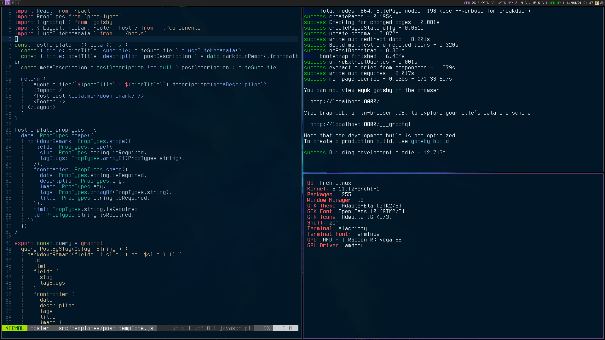
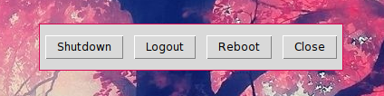

# equk :: dotfiles

Configuration for Arch Linux with custom scripts allowing install & backup.

More Info: [Automated dotfiles - equk's blog](https://equk.co.uk/2019/07/24/automated-dotfiles)

    OS: Arch Linux
    Kernel: 5.18.15
    Packages: 1456
    Window Manager: i3
    Shell: zsh
    Terminal: alacritty
    Terminal Font: JetBrains Mono Nerd Font
    GPU: AMD ATI Radeon RX Vega 56
    GPU Driver: amdgpu
    Disk Encryption: AES-256 (512bit aes-xts-plain64)
    (root fs uses LUKS + dm-crypt)

## Installation

    install.sh

### vscode

to install vscode extensions run

    xargs -n 1 -a lists/vscode_extensions.txt code --install-extension

### neovim

neovim config should install plugins automatically using packer

requirements:

- ripgrep
- rust-analyzer
- gopls
- lua-language-server (sumneko)
- tsserver

---

## Screenshots

### i3bar conky

### tk_logout

---

# Contact

Website: https://equk.co.uk

Twitter: [@equilibriumuk](https://twitter.com/equilibriumuk)
