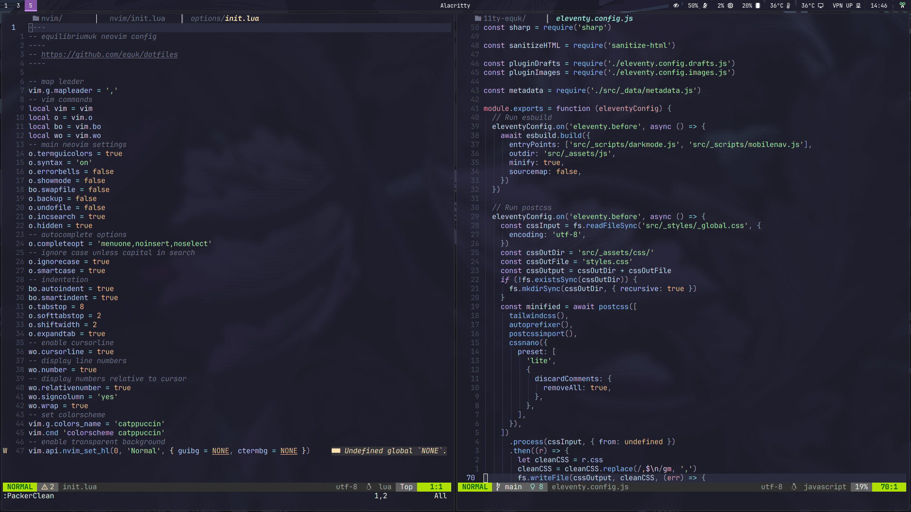

# equk :: dotfiles

Configuration for Arch Linux with custom scripts allowing install & backup.

More Info:

- [Automated dotfiles - equk's blog](https://equk.co.uk/2019/07/24/automated-dotfiles)
- [Switching to Wayland - equk's blog](https://equk.co.uk/2023/09/08/switching-to-wayland/)

> [!NOTE]
> Currently moving/testing NixOS

| | |
|---|---|
| OS | [Arch Linux](https://archlinux.org/) |
| Window Manager | [Hyprland](https://hyprland.org/) |
| Lock Screen | [Hyprlock](https://github.com/hyprwm/hyprlock) |
| Status Bar | [Waybar](https://github.com/Alexays/Waybar) |
| Terminal | 🦀[Alacritty](https://alacritty.org/) |
| Shell | 🦀[fish](https://github.com/fish-shell/fish-shell) |
| Shell History | [atuin](https://github.com/atuinsh/atuin) |
| Editor | [neovim](https://github.com/neovim/neovim/) |
| Editor2 | [vscode](https://github.com/microsoft/vscode/) |
| Launcher | [wofi](https://sr.ht/~scoopta/wofi/) |
| File Manager | [thunar](https://docs.xfce.org/xfce/thunar/start/) |
| Media Player | [mpv](https://mpv.io/) |
| Web Browser | [firefox](https://www.mozilla.org/firefox/) |
| Notes | [obsidian](https://obsidian.md/) |
| Daily Notes | [obsidian.nvim](https://github.com/epwalsh/obsidian.nvim) |
| Feed Reader | [newsboat](https://github.com/newsboat/newsboat) |
| Git TUI | [lazygit](https://github.com/jesseduffield/lazygit) |
| Dir Jump | 🦀[zoxide](https://github.com/ajeetdsouza/zoxide) |
| File Listing | 🦀[eza](https://github.com/eza-community/eza) |

## Installation

    install.sh

### vscode

to install vscode extensions run

    xargs -n 1 -a lists/vscode_extensions.txt code --install-extension

### neovim

neovim config should install plugins automatically using lazy.nvim

language servers are installed using linux package manager (not mason)

### firefox

firefox profiles are managed using [ffox_profile_tools](https://github.com/equk/ffox_profile_tools)

> firefox profiles with security & privacy settings already preset

### hyprland

hyprland is built from source as archlinux official package always seems to be behind

---

# Contact

Website: https://equk.co.uk

Mastodon: [@equilibriumuk@hachyderm.io](https://hachyderm.io/@equilibriumuk)

Bluesky: [@equilibriumuk.bsky.social](https://bsky.app/profile/equilibriumuk.bsky.social)
