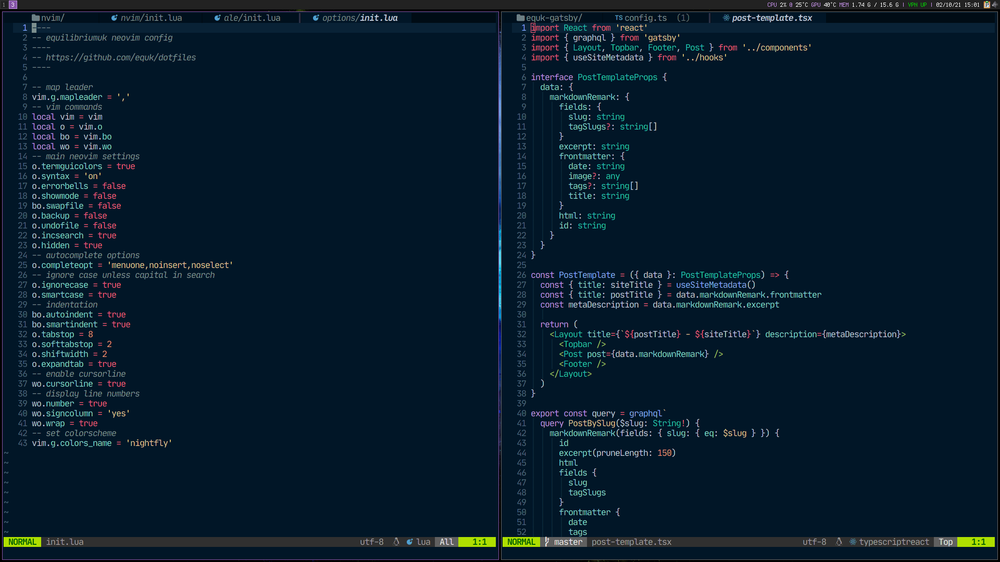

# dotfiles

    OS: Arch Linux
    Kernel: 5.5.4-1-EQUK
    Packages: 1349
    Window Manager: i3
    GTK Theme: Adapta-Eta [GTK2/3]
    GTK Font: Noto Sans 10 [GTK2/3]
    GTK Icons: Paper [GTK2/3]
    Shell: zsh
    Terminal: alacritty
    Terminal Font: xos4 Terminus
    GPU: AMD ATI Radeon RX Vega 56
    GPU Driver: amdgpu

## screenshots

### i3bar conky

### tk_logout

---

## script design

I designed the script to copy files as an alternative to having symlinks everywhere.

This allows me to control when I commit config changes to github (there may be times when testing settings etc).

It also means I don't have symlinks across different disk mount points.

install & backup features:

- [x] create folder structure if required
- [x] prompt before overwriting existing configuration
- [x] check for changes using diff
- [x] cli feedback for each config file
- [x] checks user is not root

## folder structure

    .
    ├── backup.sh
    ├── install.sh
    ├── configs/
    ├── lists/
    └── sys/

- `configs` contains config files from users `home` directory
- `lists` contains vscode extensions list
- `sys` contains files from linux system (eg: `/etc/`)

## install

    install.sh

output:

    equk :: linux dotfiles install
    ------------------------------

        git: https://github.com/equk
        web: https://equk.co.uk

    +++ installing equk dotfiles

    [+] Copying ./configs/.zsh/config.sh to /home/user/.zsh/config.sh
    [+] Copying ./configs/.zsh/lib/completion.zsh to /home/user/.zsh/lib/completion.zsh
    [+] Copying ./configs/.zsh/lib/tmux.zsh to /home/user/.zsh/lib/tmux.zsh
    [+] Copying ./configs/.zsh/lib/keyfix.zsh to /home/user/.zsh/lib/keyfix.zsh

### vscode install

to install vscode extensions run

    xargs -n 1 -a lists/vscode_extensions.txt code --install-extension

### vim install

install Vundle and plugins

    mkdir -p ~/.vim/bundle
    git clone https://github.com/VundleVim/Vundle.vim.git ~/.vim/bundle/Vundle.vim
    vim +PluginInstall +qall

more info on plugins can be found in `lists/vim_plugins.md`

## vim colorscheme

To install the `jellybeans` vim colorscheme

    mkdir -p ~/.vim/colors
    cd ~/.vim/colors
    curl -O https://raw.githubusercontent.com/nanotech/jellybeans.vim/master/colors/jellybeans.vim

## backup

    backup.sh

output:

    equk :: linux dotfiles backup
    -----------------------------

       git: https://github.com/equk
       web: https://equk.co.uk

    +++ copying dotfiles to /dotfiles/configs

    [+] copying base files
      [+] Copying /home/user/.bashrc
      [+] Copying /home/user/.vimrc
      [+] Copying /home/user/.zshrc
      [+] Copying /home/user/.tmux.conf
      [+] Copying /home/user/.compton.conf

# Contact

Website: https://equk.co.uk

Twitter: [@equilibriumuk](https://twitter.com/equilibriumuk)
